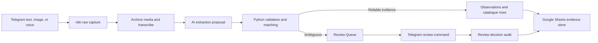

# HOWO Parts Sourcing and Stock Decision Engine

An evidence-first capture and identification backend for HOWO/SINOTRUK spare-parts businesses in Nigeria. It turns rough Telegram messages, images, and voice notes into structured, reviewable records without treating uncertain AI output as fact.

This repository is a sanitized portfolio snapshot. It contains no live credentials, customer records, supplier contacts, or production n8n exports.

## Problem

Parts knowledge is often scattered across chat messages, photographs, voice notes, market conversations, and memory. Product names are inconsistent, visually similar parts may have different fitment, and a supplier report can become stale quickly. Copying this information directly into a stock decision creates expensive risks:

- an unverified part number may be attached to the wrong product;
- a photograph may suggest a match without proving fitment;
- duplicate messages may create conflicting records;
- a historical supplier report may be mistaken for current availability;
- AI-generated structure may hide uncertainty or unsupported claims.

The project preserves the original evidence, extracts proposed structure, performs deterministic validation and matching, and routes ambiguity to a human review queue.

## Intended users

- HOWO/SINOTRUK parts sellers and inventory buyers;
- market researchers recording product and supplier observations;
- operators who need a searchable catalogue built from daily field knowledge;
- reviewers responsible for confirming product identity, fitment, and part numbers.

## Input to output

1. A restricted Telegram bot receives text, an image, or a short voice note.
2. n8n creates a stable capture ID and preserves the raw message.
3. Media is archived and voice audio can be transcribed.
4. AI proposes structured claims or visible features using versioned prompts.
5. The local Python service validates the proposed structure.
6. Deterministic matching ranks known products. Confirmed exact part numbers have the highest authority.
7. Reliable claims become append-only observations. Ambiguous identity becomes an open review item.
8. A reviewer can link a known product, create a provisional product, reject the match, accept an image, or explicitly confirm a physically checked part number.
9. Every review decision produces an immutable audit row.



## Architecture

| Component | Responsibility |
| --- | --- |
| Telegram | Low-friction field capture and review commands |
| n8n | Orchestration, media handling, transcription, Google Sheets reads/writes, and Telegram responses |
| `howo_capture` Python package | Validation, normalization, deterministic matching, review resolution, image-evidence routing, and freshness-aware supplier ranking |
| Google Sheets workbook | Human-readable evidence store and operating database |
| Google Drive | Durable archived media referenced by the evidence rows |
| OpenAI transcription/extraction nodes | Propose transcripts and structured evidence; they do not make final identity decisions |

The local HTTP service exposes:

- `POST /v1/process`
- `POST /v1/visual-evidence`
- `POST /v1/identify-image`
- `POST /v1/identify`
- `POST /v1/catalogue-context`
- `POST /v1/resolve-review`
- `POST /v1/resolve-review-command`
- `POST /v1/supplier-reports`
- `GET /health`

## Evidence and safety rules

- Raw messages and source references are retained.
- User claims, observations, calculations, and AI inferences remain distinguishable.
- Fuzzy names, OCR, and image similarity never silently confirm a product.
- A newly created product remains provisional.
- A part number becomes confirmed only after an explicit human check with a source reference.
- Supplier reports are dated and always require reconfirmation before quoting or purchasing.
- Stable IDs make retries safe and prevent duplicate logical records.

See [the evidence policy](docs/evidence-policy.md) and [the north-star brief](docs/north-star.md) for the governing rules.

## Technologies

- Python 3.11+ standard library
- `unittest`
- n8n 2.x workflow export
- Telegram Bot API through n8n
- Google Sheets and Google Drive through n8n
- Docker and Docker Compose
- JSON Schema-style versioned contracts
- JavaScript and Python workflow-maintenance tools

The core Python package has no third-party runtime dependencies. `pyproject.toml` is therefore the complete dependency declaration and no lockfile is required for the core service. The optional workbook generator uses `@oai/artifact-tool`; the generated workbook is already committed and the generator is not needed to run the service.

## Repository structure

```text
src/howo_capture/       Python service and deterministic domain logic
tests/                  Unit, API, and n8n export tests
workflows/              Sanitized n8n workflow and node code
schemas/                Request and extraction contracts
prompts/                Versioned extraction prompts
examples/               Synthetic request fixtures
outputs/                Empty Google Sheets-ready workbook template
docs/                   Design, setup, evidence policy, and portfolio evidence
tools/                  Workflow and workbook maintenance scripts
```

## Run locally

### Python

```bash
python3 -m venv .venv
source .venv/bin/activate
python -m pip install -e .
python -m howo_capture process examples/process-known-part.json
python -m howo_capture serve --host 127.0.0.1 --port 8765
```

Check the service:

```bash
curl http://127.0.0.1:8765/health
```

### Docker

Create the external network once if n8n does not already provide it:

```bash
docker network create n8n-network
docker compose -f compose.capture.yml up --build -d
curl http://127.0.0.1:8765/health
```

The service is bound to localhost by default. Do not expose it publicly without adding authentication.

### Tests

```bash
PYTHONPATH=src python3 -m unittest discover -s tests -v
```

### n8n integration

1. Import `workflows/telegram_raw_capture_v1.json`.
2. Add Telegram, Google Sheets, Google Drive, and OpenAI credentials inside n8n. Never put them in the JSON export.
3. Replace the placeholder Telegram user ID and spreadsheet ID.
4. Upload `outputs/telegram-capture-v1/howo_parts_capture_template.xlsx` to Google Drive and open it as a Google Sheet.
5. Confirm header row `3` and first data row `4` in each Sheets node.
6. Keep the workflow inactive until the Telegram sender restriction is configured.

Detailed steps are in [Capture v1 setup](docs/setup-capture-v1.md).

## Verified outputs

The sanitized known-part fixture produces:

- `processing_status: structured`;
- extraction validation with no issues;
- an exact-part-number match at confidence `1.0`;
- one replay-safe observation row;
- one unreviewed captured part-number row;
- no review-queue row for that exact confirmed match.

The portfolio evidence folder contains the exact sanitized input, a verified CLI-output summary, workbook screenshots, and an input-to-output visual: [docs/portfolio-evidence](docs/portfolio-evidence/README.md).

## Current implementation status

Implemented:

- text, image, and voice-note capture workflow;
- Drive media archival and voice transcription path;
- schema-constrained evidence proposals;
- deterministic product matching and review routing;
- image/OCR evidence handling that stays unconfirmed until review;
- Telegram review commands and immutable review decisions;
- supplier-report freshness ranking;
- a 14-tab Google Sheets-ready template;
- automated tests for domain rules, API endpoints, and workflow safety.

Not yet implemented as a production product:

- authenticated multi-user access;
- a dedicated web/mobile interface;
- automated external market research;
- calibrated computer-vision retrieval over a large reviewed image catalogue;
- production monitoring, backup policy, and deployment hardening;
- an inventory purchasing dashboard and configurable capital-allocation scorecard.

## Portfolio evidence

- [Sanitized input](docs/portfolio-evidence/sanitized-sample-input.json)
- [Verified output](docs/portfolio-evidence/sanitized-sample-output.json)
- [Input screenshot](docs/portfolio-evidence/01-sanitized-input.png)
- [Process screenshot](docs/portfolio-evidence/02-processing-flow.png)
- [Output screenshot](docs/portfolio-evidence/03-verified-output.png)
- [Workbook template](outputs/telegram-capture-v1/howo_parts_capture_template.xlsx)

All names, identifiers, timestamps, URLs, and examples in the portfolio evidence are synthetic or placeholders.

## License and data

No license has been selected. All portfolio fixtures are synthetic. Live operational exports, credentials, contacts, customer messages, and supplier records are intentionally excluded.
